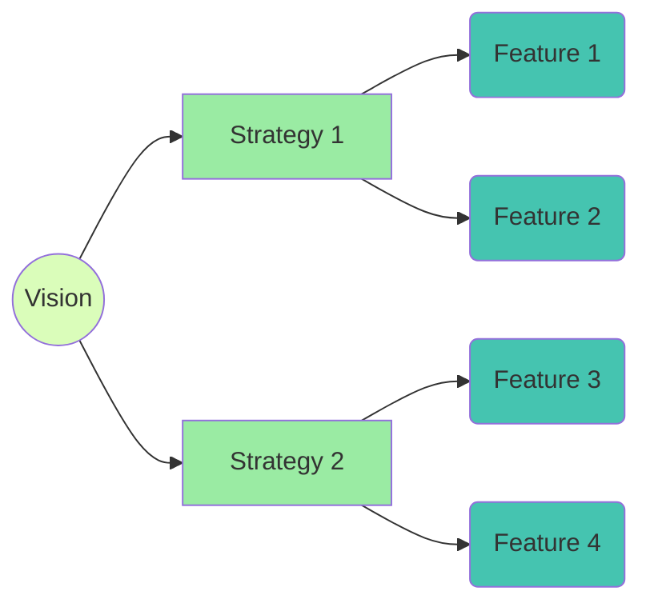
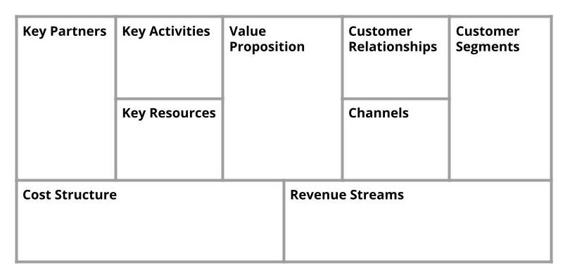
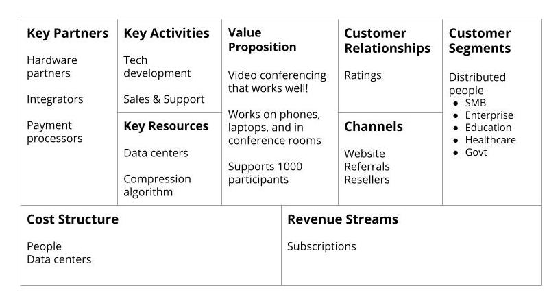
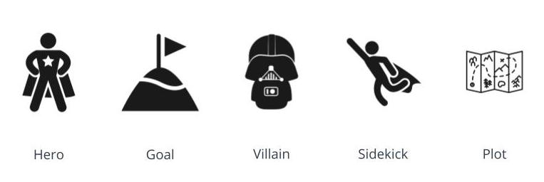
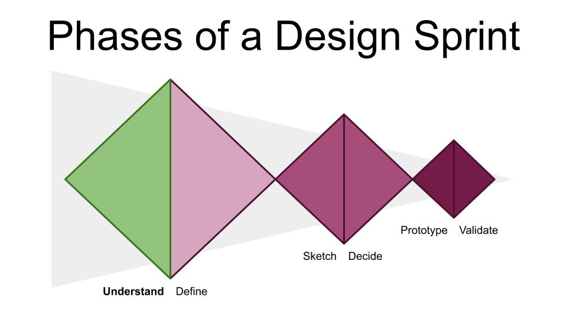

# Product Manager Nanodegree

- [Product Manager Nanodegree](#product-manager-nanodegree)
  - [What a PM does in a product](#what-a-pm-does-in-a-product)
    - [Identifying Problems](#identifying-problems)
    - [Creating Solutions](#creating-solutions)
    - [Planning](#planning)
    - [UX Design](#ux-design)
    - [Implementation](#implementation)
    - [Testing](#testing)
    - [Launch](#launch)
    - [Review](#review)
  - [What else a PM does](#what-else-a-pm-does)
    - [Communicating All the time](#communicating-all-the-time)
    - [Coordinating All the Time](#coordinating-all-the-time)
    - [All the Other Small Stuff All the Time](#all-the-other-small-stuff-all-the-time)
  - [Who PMs work with (everyone!)](#who-pms-work-with-everyone)
    - [User Researchers](#user-researchers)
      - [Role](#role)
      - [Interactions](#interactions)
    - [Designers](#designers)
      - [Role](#role-1)
      - [Interactions](#interactions-1)
    - [Engineers](#engineers)
      - [Role](#role-2)
      - [Interactions](#interactions-2)
    - [Technical Program Managers and Program Managers](#technical-program-managers-and-program-managers)
      - [Role](#role-3)
      - [Interactions](#interactions-3)
    - [Differences between Product and Program Managers](#differences-between-product-and-program-managers)
    - [Quality Assurance](#quality-assurance)
      - [Role](#role-4)
      - [Interactions](#interactions-4)
    - [Data Science](#data-science)
      - [Role](#role-5)
      - [Interactions](#interactions-5)
    - [Marketing & PR](#marketing--pr)
      - [Role](#role-6)
      - [Interactions](#interactions-6)
    - [Sales](#sales)
      - [Role](#role-7)
      - [Interactions](#interactions-7)
    - [Support](#support)
      - [Role](#role-8)
      - [Interactions](#interactions-8)
    - [Legal & Privacy](#legal--privacy)
      - [Role](#role-9)
      - [Interactions](#interactions-9)
    - [Internacionalization Team (i18n)](#internacionalization-team-i18n)
      - [Role](#role-10)
      - [Interactions](#interactions-10)
  - [New PM Role](#new-pm-role)
    - [Company](#company)
    - [People](#people)
    - [Product](#product)
    - [Other](#other)
  - [Identifying Requirements](#identifying-requirements)
    - [Origin](#origin)
    - [Tips](#tips)
  - [The Roadmap](#the-roadmap)
    - [Tips for creating a roadmap](#tips-for-creating-a-roadmap)
    - [Example 1](#example-1)
    - [Example 2](#example-2)
  - [The Product Requirements Document (PRD)](#the-product-requirements-document-prd)
    - [Components](#components)
    - [Optional Components](#optional-components)
    - [Example](#example)
    - [Priorities](#priorities)
  - [Identifying Opportunities](#identifying-opportunities)
    - [How to figure out which problem to solve](#how-to-figure-out-which-problem-to-solve)
    - [Constraints & Tradeoffs](#constraints--tradeoffs)
    - [Business Goals](#business-goals)
  - [Understanding the Market](#understanding-the-market)
    - [What makes a good market?](#what-makes-a-good-market)
    - [Ways to get more Market insight](#ways-to-get-more-market-insight)
  - [Target User](#target-user)
    - [Who is your target user?](#who-is-your-target-user)
    - [Finding your target user](#finding-your-target-user)
    - [User Characteristics](#user-characteristics)
    - [User Personas](#user-personas)
    - [Creating a Persona](#creating-a-persona)
    - [Example](#example-1)
      - [Description](#description)
      - [Frustration](#frustration)
      - [Goals](#goals)
      - [Motivation](#motivation)
  - [Total Addressable Market (TAM)](#total-addressable-market-tam)
    - [Calculating TAM](#calculating-tam)
      - [Top Down](#top-down)
        - [Example](#example-2)
      - [Bottom Up](#bottom-up)
        - [Example](#example-3)
      - [Value Theory](#value-theory)
  - [Return on Investiment (ROI)](#return-on-investiment-roi)
      - [Example](#example-4)
    - [Payback Period](#payback-period)
      - [Example](#example-5)
  - [Creating & Evaluating Hypotheses](#creating--evaluating-hypotheses)
  - [Creating a business case](#creating-a-business-case)
  - [Vision & Strategy](#vision--strategy)
    - [What is Vision?](#what-is-vision)
    - [Vision needs to tell a story about:](#vision-needs-to-tell-a-story-about)
    - [Creating Vision](#creating-vision)
    - [Strategy](#strategy)
    - [Business Models](#business-models)
      - [Business Model Canvas](#business-model-canvas)
      - [Business Model Canvas Walkthrough (Example)](#business-model-canvas-walkthrough-example)
    - [Revenue Models](#revenue-models)
    - [Competitive Analysis](#competitive-analysis)
    - [MVP](#mvp)
    - [KPIs](#kpis)
  - [Communication Skills](#communication-skills)
    - [Active Listening](#active-listening)
    - [Storytelling](#storytelling)
    - [Being Persuasive](#being-persuasive)
    - [Presentations](#presentations)
    - [Negotiation](#negotiation)
  - [Introduction to Design Thinking](#introduction-to-design-thinking)
    - [Introduction to Design Sprint](#introduction-to-design-sprint)
    - [Phase 1 - Understand](#phase-1---understand)

## What a PM does in a product

### Identifying Problems

- Define the Problem
- Understand user & needs
- Conduct market & user research

### Creating Solutions

- Strategy for how to solve
- A high-level overview of what the product does
- How it relates to goals & KPIs

### Planning

- Timelines
- Splitting into milestones

### UX Design

- Mocks and specs
- Review and provide context
- Usability testing

### Implementation

- Are the requirements clear?
- What edge cases haven’t we thought of yet?
- Are we on track?

### Testing

- How should it work?
- Does it work?
- What needs to be fixed?

### Launch 

- Silent launch (optional)
- Big announce (optional)
- Slow roll (optional)

### Review

- How did things go?
- What was the impact?
- What did we learn?

## What else a PM does

### Communicating All the time

- Need to communicate
- Product Status
- Timelines
- Decisions
- Risks
- Blockers
- Establish Inbound Communication
- Know Team and company priorities
- How the product fits into the company priorities

### Coordinating All the Time

- Coordinate the development and the launch of a product, across all teams involved:
- engineering
- design
- marketing
- legal
- support
- Remove blockers
- Make sure things get done

### All the Other Small Stuff All the Time

- Creating a mock
- Reviewing small code changes
- Analyzing experiment results
- Writing support content
- Keep the team happy
- and more…

## Who PMs work with (everyone!)

### User Researchers

#### Role
- Discover key user insights and behaviors
- Help answer important questions
- Get feedback from usability testing

#### Interactions
- Align on research priority & questions to answer
- Share research findings
- Participate in research together

### Designers

#### Role
- Design what the produt should look like
- Design how users should be able to interact with the product
- Make sure we're solving the right problems for users

#### Interactions
- Align on problem definition and scope
- Review PRD and mocks
- Compromise on ideal design solution vs technical limitations or timeline pressure

### Engineers

#### Role
- Build the product
- Maitain the product
- Solve hard problems

#### Interactions
- Review requirements, PRD, and mocks
- Discuss feasibility and timelines
- Create a plan for tackling technical debt

### Technical Program Managers and Program Managers

#### Role
- Project management
- Report status of projects
- Keep the team on schedule
- Flag any riks and slips in schedule

#### Interactions
- Go through prioritization exercises
- Discuss timelines
- Review roadmap

### Differences between Product and Program Managers

|Product Manager (PM) | Program Manager (PgM)| Technical Program Manager (TPM) |
| --- | --- | --- |
| Understand the user, the problem, and the market | Understanding the team the org, and how to get things done | More involved in all the technical details of software developments |
| Figuring out what to build | Executing against the roadmap | |

### Quality Assurance

#### Role
- Test the product to make sure everything works correctly
- Document bugs
- Increase testing capabilities

#### Interactions
- Review PRD
- Review test plan and expected behaviors
- Flag bugs and prioritize

### Data Science

#### Role
- Provide key insights based on data
- Design and roll out experiments
- Quantify impact

#### Interactions
- Align on Data Science priorities
- Review PRD
- Review results from experiments

### Marketing & PR

#### Role
- Explain what the product is
- Manage web & social presence
- Lead user acquisition campaigns
- Organize press events
- Make sure the right story lands

#### Interactions
- Align on Marketing priorities
- Discuss production positioning
- Review launch announcements and presentations
- Pre-briefing for interviews
- Help to support press review issues

### Sales

#### Role
- Sell the product
- Build relationships with customers
- Insight into customer sentiment

#### Interactions
- Review roadmap and upcoming features
- Discuss feedback from customers and product shortcomings
- Discuss features that would drive sales enablement

### Support

#### Role
- Help users when they run into problems
- Track top issues users encounter
- Improve support processes and tooling

#### Interactions
- Review PRDs and roadmap
- Discuss top customer issues
- Discuss supportability

### Legal & Privacy

#### Role
- Compliance with the law and privacy regulations
- Make sure data is being collected with purpose, stored appropriately, and deleted when no longer needed

#### Interactions
- Review roadmap and PRDs
- Review flows and messaging
- Review data collection and storage
- Discuss new legal & privacy requirements

### Internacionalization Team (i18n)

#### Role
- Adapt the product for other countries
- Translate the content in the product to other languages

#### Interactions
- Review expansion plans and prioritize
- Review any i18n bugs

## New PM Role

**Imagine that you have just started a job at a new company as a PM. How would you want to structure your first weeks on the job?**

- What do you want to learn about the company?
- Who do you want to meet?
- How do you want to learn about the current state of your product?
- Anything else worth mentioning?

### Company

- What the company does
- How the company makes money
- Short term goals and objective
- Long term goals and objectives
- Current projects in flight

### People

- Meet people:
  - My manager
  - My manager's manager
  - Other PMs
  - Design partner
  - Research partner
  - Eng partner
  - TPM partner
  - QA partner
  - Data Science
  - Marketing
  - PR
  - Sales
  - Support
  - Legal & Privacy
  - Policy
  - Ops

### Product

- Product Experience
  - Check out the product’s website
  - Review the app store listing
  - Use the product
  - Journal of my experience using it
  - Questions that I have about why it is the way it is
  - List of issues that I encountered while using the product
  - Get help for the product
  - Review the support site
  - Reach out to customer support for help with an issue
  - Use competitor products
  - Compare similarities and differences

### Other

- Process
- Learn the process for how to get things done
  - What needs to be reviewed
  - What requires approval
- Shadow support and listen to customer calls

## Identifying Requirements

### Origin

- Research
  - Quick online research by your own
  - Looking information the team already collected
  - Doing Marketing User Research

- User Interviews
  - Problems and challenges
  - Empathy

- Stakeholder Interviews
  - Business objectives
  - Requirements from other stakeholders (Marketing, Legal, ...)

- Prototyping
  - Connect all the dots
  - Missing screen?
  - Is there a critical interaction missing?

- and more...

### Tips

- Dig into the user motivations
- Document everything (PRD and steps)
- Do I have all the requirements? Probably not.
- Keep the PRD up-to-date (versioned)
- Be transparent

## The Roadmap

A product roadmap is the plan that the team will be executing against. Product roadmaps provide a high level overview of the direction of the product over time. It calls out work that is required to meet business objectives and roughly when that work needs to happen.

Roadmaps are a powerful artifact because they set expectations across the team in terms of the team’s priorities. They also are a powerful mechanism for driving alignment across various stakeholders and making tradeoffs between new requests and planned work.

### Tips for creating a roadmap

- Tell a cohesive story
  - What the team is going to build?
  - How everything is related?
  - Why this product is so important?
  - You can do this:
    - Focusing in themes or goals
    - Linking those specific projects back to those themes and goals along with an estimated impact
- Get buy in (get support from stakeholders)
- Say no
  - "Innovation is not about saying yes to everything. It's about saying NO to all but the most crucial features" - Steve Jobs
- Attach goals

### Example 1

|  | Q1 | Q2 | Q3 | Q4 |
| --- | --- | --- | --- | --- |
| Improve user onboarding | Feature B (+10% conversion) | Feature A (+3% conversion) |  |  |
| New Markets | Feature C Feature D (launch in 3 new markets) |  |  |  |
| Debt |  | iOS 13 (support new iPhone) | Migration Milestone 1 (move to faster backend)  Android 10 (support new Android phones) | Migration Milestone 2 (move to faster backend) |

### Example 2

|  | Q1 | Q2 | Q3 | Q4 |
| --- | --- | --- | --- | --- |
| Backend | Feature B Feature C | Feature A | Migration Milestone 1 | Migration Milestone 2 |
| Android | Feature B Feature D |  | Android 10 compability updates |  |
| iOS | Feature B | iOS 13 compability updates |   |   |

## The Product Requirements Document (PRD)

The PRD is the source of truth that answers the question WHAT is the team building and WHY, which is incredibly helpful to drive alignment across the team. A PRD is never done and will continue to evolve as the team is working on the problem. It’s the PM’s job to write the PRD and keep it up to date as decisions are made and new information becomes available.

### Components

- frame the problem...and answers the question WHY are we solving it.
- outline the goals...both user goals, business goals, and success metrics. This section also helps to explain WHY the problem should be solved.
- describe the requirements...WHAT does the product do? Remember, as a PM you are answering WHAT the product does. **Design and engineering have to figure out HOW**.

### Optional Components

- assumptions
- options considered
- UI mocks (it can be super helpful to work with design and include these in the PRD because it is often easier to communicate some ideas visually instead of through text)
- out of scope
- risks & mitigations
- support plan

### Example

**Background**

[Provide any relevant background information about the industry or the problem.]

**Problem**

[Describe the opportunity. What are the benefits to the user? What are key insights? What the competition does? Why does this matter?]

**Goals**

[What does success look like?]

**Success Metrics**

[How do you measure success?]

**Key Features & Scope**

[What are you building? What are you explicitly not building?]

**Core UX Flow**

[Link to mocks]

### Priorities

When you are writing a PRD you'll want to include a priority level. We use this shorthand:

| Term | Definition |
| --- | --- |
| P0 | A launch blocking feature. The product will not launch without it |
| P1 | A nice to have feature at launch, but not required. If not present at launch it should be a fast follow |
| P2 | A desirable feature |
| P3, P4| Unlikely to get built |

## Identifying Opportunities

### How to figure out which problem to solve

- Research
  - Market
  - User
- Product Data (if you already have a product)
- Support Data
- Efficiency gains

### Constraints & Tradeoffs

- Time is limited
- Different impact

### Business Goals

- Revenue
- New Users
- Engagement
- Costs
- Churn
- etc

**Viable Product Opportunities are the overlap between Problems and Business Goals.**

*"You can change everything in your startup except the market. So spend a lot of time up front to make sure you've thought through your market."* - Sam Altman

## Understanding the Market

*"Product/market fit means being in a good market with a product that can satisfy that market."* - Marc Andreesen

### What makes a good market?

- Size: How many people have this problem?
- Growth: Is the size of the market increasing?
- Acquisition: How much does it cost to acquire customers?

| No Product/Market Fit | Good Product/Market Fit |
| --- | --- |
| Users aren't getting value | Users get a lot of value |
| No word of mouth | Product practically sells itself |
| No press buzz | Press is reaching out to talk to you about your product |
| Slow growth | Product in high demand |

### Ways to get more Market insight

- Online research
- Headlines & News
- Similar products
- Trends
  - [Mary Meeker’s Internet Trends](https://www.bondcap.com)
  - Google Trends
  
**Exercise**

Imagine that the team is interested in building a product to help people better track their fitness and improve their health over time. Spend a little bit of time doing some research to better understand current trends in the fitness tracking market.

Here are some questions to get you started:

- What benefits does improving fitness provide?
- What products are already in the market?
- How much do people spend on health/fitness?
- What are the different ways to deliver fitness tracking?
- What are the pros and cons?

Guidelines:

- Do some online research to identify the benefits of improving fitness
- Identify at least 5 fitness tracking improvement products that are already in the market
- Do some online research to identify how much money people spend on health & fitness (break into items)
- Do some online research to identify different ways that fitness tracking products could be built and delivered, along with their associated pros and cons

Pros and cons:

| | Hardware | Watch App | Phone App |
| --- | --- | --- | --- |
| **Investment** | Large | Medium | Medium |
| **Ease of use** | Effortless | Effortless | Some friction |
| **Market** | Small | Medium | Large |

## Target User

Identifying a target user is important, because it makes it very clear who you are building the product for. Oftentimes, a problem will best be solved in different ways for different types of users. Identifying a target user creates focus and lets you focus on solving the needs of that specific target user.

### Who is your target user?

Your target user represents a set of users with shared characteristics, like demographics, motivations, goals, and frustrations, who are likely interested in your product. To identify your target user, you will need to talk to your users and do market research,

### Finding your target user

- Review data including market research
- Perform interviews
- Conduct surveys
- Run focus groups
- Review existing customer data

### User Characteristics

- Demographics
- Motivations
- Goals
- Frustrations

### User Personas

Once you've identified trends across these characteristics for your users, you can create user personas to represent them. A user persona is a fictional person that you create who might use your product.

As you're developing the product, you'll refer back to your personas, in order to stress test and challenge some of your ideas.

### Creating a Persona

1. Start by creating a name for your persona
2. Include a photo, or illustration of what this user might look like
3. Add a quote with a key insight about this user.
4. Include a description of the user with details that are relevant to your product
5. Outline the user's goals
6. Describe what motivates the user

### Example

**Sam Student**

#### Description

Sam is just starting her first job out of school and lives with two other roommates. She loves being outside and is a big runner. But after adjusting to having a new schedule has found it challenging to make time to exercise on a regular basis.

#### Frustration

- New schedule makes prioritizing exercise difficult
- Feels intimidated to get back into the gym

#### Goals

- Exercise more consistently
- Be able to complete an upcoming marathon

#### Motivation

- Seeing progress over time
- Being able to share progress with friends and family

## Total Addressable Market (TAM)

> **Total Addressable Market** is a measure of the revenue opportunity for a product.

Keep in mind that TAM is not a measure of your revenue or future revenue. Instead, it allows you to understand the size of the market if you had 100% of the market. A larger TAM indicates a larger opportunity, with more demand for a particular product. However, just because there’s a large TAM does not mean that a product is guaranteed to be successful...

There are lots of other factors that will come into play, like competition.

### Calculating TAM

$$TAM = ARPU \times PUM$$

> where:   
>
>  *TAM*: Total Addressable Market      
>  *ARPU*: Average Revenue per User  
>  *PUM*: Total Number of Potential Users in the Market

There are several approaches to calculating TAM:

#### Top Down

Start with a high level view of the economy, and then narrow that down based on factors like demographics. For example, you usually will start will everyone in the world and narrow down that audience to people who are interested in your product.

##### Example

7.8 billion people on Earth 
330 million people in the US 
2 liters per day 
\$1 per liter

 

*(330 million people) x (2 liters per day) x ($1 per liter) x (365 days per year)= $241B*

#### Bottom Up

Use known data points that you have (data from early customers and sales) that you could extrapolate to represent a larger market opportunity. For example, if you are already selling a product in one region and were considering selling it globally.

##### Example

330 million people in the US 
25% of population buys one liter per day 
$1 per liter 

 

*(330 million people) x (25% of people) x ($1 per liter) x (365 days per year)= $30.1B*

#### Value Theory

Used for new product categories where you don’t have much information to base estimates on. This involves conducting market research to understand how much people would pay for your product and how many potential customers you have.

$$TAM = PRICE \times PEOPLE$$

> where:   
>
>  *TAM*: Total Addressable Market      
>  *PRICE*: how much would people pay for the product  
>  *PEOPLE*: how many people would purchase the product

## Return on Investiment (ROI)

> ROI a way to measure the **efficiency** of an investment.  

Calculating ROI for different problems will help you to understand where to focus your team’s time in order to have the biggest impact.

$$ROI = \frac{amount_{gained} - amount_{spent}}{amount_{spent}}$$

For software products, it looks like this:

$$ROI = \frac{impact - cost_{development\:time}}{cost_{development\:time}}$$

> Projects with positive ROIs will cover the investment required to build the products. 

> Projects with negative ROIs will not and won’t make sense to pursue.

**Key Points**:

- The $amount_gained$ can be an increase in sales or a decrease in costs.
- ROI calculations can get tricky so you may want to work with the Finance team or the Data Science team for help
- The $cost_{development\:time}$ is based on how many people are involved and how long it takes to complete the project.

#### Example

You have $5 to spend. Which problems shoult you solve?

|Problem|Cost|Impact|ROI Calculation|ROI|Solve?|
| --- | --- | --- | --- | --- | --- |
|A|$5|$18|$\frac{18 - 5}{5}$|260%|No|
|B|$3|$10|$\frac{10 - 3}{3}$|233%|Yes|
|C|$2|$6|$\frac{6 - 2}{2}$|200%|No|
|D|$1|$10|$\frac{10 - 1}{1}$|900%|Yes|

- Problem D: **SOLVE** because it has the best ROI and lowest cost
- Problem A: **DO NOT SOLVE** because it has a lower ROI than Problem D and if you spend $1 to solve Problem D, you don't have enough money to solve Problem A
- Problem B: **SOLVE** because it has the next highest ROI and you have enough money left to solve it after solving Problem D
- Problem C: **DO NOT SOLVE** because it has the lowest ROI and if you solve Problem B and Problem D, you don't have enough money to solve it anyway

### Payback Period

Payback period measures the amount of time that it takes for a product to recoup the initial investment required to build it.

$$Payback\,Period = {Cost}/(\frac{Impact}{Time})$$

#### Example

We often start by calculating the impact per year

$$Impact\,per\,year = (\frac{Impact}{Years})$$

and divide the cost by the impact per year:

$$Payback\,Period = (\frac{Cost}{Impact\,per\,year})$$

|Problem|Cost|Impact|Impact per year|Payback Period|
| --- | --- | --- | --- | --- |
|A|$5|+ $18 over 3 years|$6|10 months|
|B|$3|+ $10 over 5 years|$2|1.5 years|
|C|$2|+ $6 over 3 years|$2|1 year|
|D|$1|+ $10 over 10 years|$1|1 year|

## Creating & Evaluating Hypotheses

Before you build a product… you want to be sure that it will be successful. You can create hypotheses to make sure that your assumptions about your product are correct-- and that you are solving a real problem for real people. After creating your hypotheses, you can test them to see if they are true / still accurate in the real world.

Your hypotheses should be based on:

|Type|Questions|
| --- | --- |
|Customer Need| - Is this a real problem? - Is this an urgent problem?|
|Your Solution|- Does it really solve the problem? - What alternative does the customer have? - Is your solution way better?|
|Differentiation|- Is it different? - How is it different?|
|Value|- How much will people pay for it? - What can you do to increase willingness to pay?|

You can test and evaluate your hypotheses in several different ways...

|Type|Details|
| --- | --- |
|User interviews|- Works best when you have a prototype - It is also useful to check if the product is something the users consider you use (or not) and buy (or not)|
|Focus groups|- The group can agree or disagree with the problem and provide alternative uses|
|Surveys|- Feedback from lots of people, but with limited depth in the type of questions|
|Design sprint|- Stress test they way the problem is framed and further define a solution|

If you find that:

- You are not addressing a customer need
- Your solution isn’t providing value
- Your product isn’t differentiated enough
- There’s no willingness to pay...

**Stop**. It’s not worth pursuing this idea in its current form because you won’t have product/market fit. You should go back and tweak which customer you are focusing on...or your solution...or pricing model.

Before you build a product...you want to be sure that it will be successful. Creating hypotheses around the problem, your solution, differentiation, and value and then testing them is a good strategy to make sure that you find product/market fit.

## Creating a business case

A business case answers the question: “Why should the company do/invest in this?”

The goal is to convince sponsors/stakeholders to approve the project. You won’t always need to go to this level of detail for all projects, like a new feature in an existing product. For smaller projects, the PRD will likely have enough detail. But for an entirely brand new product, you will need to be able to justify the larger investment. Is it worth continuing this project?

A business case should include:

- Business problem
- Benefits
- Costs
- Risks
- Possible solutions
- Timeline
- Competition

For new product investments it’s important to build a business case, which answers the question: “Does it make sense to build this?”

Your business case should be organized into the following sections:

**Executive Summary**: The Executive summary summarizes the entire document, including the recommendation. You want to make sure that it has enough detail that if it’s the only thing people read they will understand the justifications for building the product. It’s also the first thing people read and usually the last thing you will write to make sure that everything is cohesive.

**Problem Statement**: The Problem Statement explains the problem you are trying to solve, as well as the associated goals. It should also clearly link the problem back to the business strategy and goals.

**Analysis of Product Opportunity**: In the Analysis of Product Opportunity section, you discuss the merits of why solving the problem is important. You’ll usually want to touch on the cost of the problem and the size of the opportunity. Additionally, you can discuss what would happen if you didn’t solve the problem.

**Possible Solutions**: In the Possible Solutions section, you will describe the potential solutions to the problem. For each solution, you should discuss benefits, cost, timeline, and risks.

**Recommended Approach**: And finally in the Recommended Approach section, you put forward your recommendation for which solution is the best and why.

Other tips to keep in mind:

- Tailor it to your audience
- Shorter is better
- Make it interesting
- Demonstrate business value

---

## Vision & Strategy

Your vision should flow down into everything that you do

### What is Vision?

- What your product looks like in its final state
- Essence of your product
- What your product does and why it matters to users
- Can be summarized in a sentence or two

### Vision needs to tell a story about:

- What you’re building
- Who it’s for
- Why it matters

***Vision will impact every single aspect of your product so it is important to be thoughtful when you are crafting your vision.***

### Creating Vision

*"If you are working on something exciting that you really care about, you don't have to be pushed. The vision pulls you."* - Steve Jobs

You’ll want to make sure that your vision is all of the following:

|||
|---|---|
|Inspiring|- It has to make the team excited about the problem - A good way to do this is focusing in the problem you want to solve for the users and why at matters - It has to be something the team believes in|
|Ambitious|- Think big - It has to be broad and open-ended to challenge the team to think about the product in new ways - It has to be something you evolve over time|
|Easy to explain|- You have to able to summarize your vision into a short, concise sentence, or two - It has to be something you share out frequently|

Here are a few examples of vision:

- Google Wifi: A wireless router that people love
- Facebook: Connect with friends and the world around you
- Amazon: Earth's most customer centric company and a place where people can come to find and discover anything they might want to buy online
- [More examples](https://examples.yourdictionary.com/best-examples-of-a-vision-statement.html)

Vision serves as a north star to guide the team and decision making as your product is being developed. It explains what you’re building, who it’s for, and why it matters. Vision also gets the team excited and motivated about building the product.

### Strategy

Strategy is about how you are going to realize your vision and takes the following things into account:

|||
|---|---|
|User Needs|- Who is your target user? - What are their needs?|
|Key Features|- What are the key primary features that solve the user's need? - Will these features result in people using the product? - Will these features convince people to buy the product?|
|Competitors & Differentiation|- How does your product compare to others in market - What areas do you want to differentiate in?|
|Business Goals|- What are the business goals for this product? - What KPIs can you use to measure these goals?|
|Trends|- How is the market changing? - How are user behavior and needs changing?|

When you create strategy, you want to make sure that it’s:

- A balance between features, user and market needs, and business goals
- Creating building blocks for how to get to your vision
- High level, but with a little more detail
- Goal oriented, and preferably measurable

### Business Models

A business model describes how a business creates, delivers, and captures value. You can create a business model canvas, which captures a number of different components that will impact your ability to create and bring a product to market, including things you need to build the product and their associated costs, the value prop for your product, and getting your product to your customers and the associated revenue streams.

#### Business Model Canvas

The Business Model Canvas is a helpful tool to map out a business model, which was created by Alexander Osterwalder.

The Business Model Canvas is a really helpful tool to map out and understand all of the components that you need to build a product and a successful business:

- **Key Partners**: help build or deliver the product to users
- **Key Activities**: what you need to do to build and deliver the product
- **Key Resources**: things that you need to build the product
- **Cost Structure**: cost of building the product
- **Value prop**: why people would want your product
- **Customer Relationships**: how you build relationships
- **Channel**: how you get the product to customers
- **Customer Segments**: different types of customers
- **Revenue Streams**: how you get money from customers

#### Business Model Canvas Walkthrough (Example)
 
Zoom is a company that creates software for video conferencing. Here is its Business Model Canvas:

|Component|Description|Example|
|---|---|---|
|Key Partners|Key Partners help build or deliver the product to users including re-sellers or other partners like payment processors.|- Hardware partners outfit conference rooms with cameras, TVs, and tablets - System integrators integrate their technology into existing spaces - Payment processors collect money from their customers|
|Key Activities|Key Activities are the things that need to happen in order to build your product.|- Technology development - Sales and support|
|Key Resources|Key resources are things that you need in order to deliver value to the user including people, intellectual property and financial backing|- Data centers are important in order to deliver the streaming video to participants - Compression Algorithm that allows Zoom to deliver high-quality video while reducing the amount of bandwidth required|
|Cost Structure|Cost Structure looks at all of the costs that are associated with building the product, including fixed costs, like salary of the development team, and variable costs that increase as the product grows, like data center capacity. It's also important to consider which activities and resources are the most expensive.|- People - Data centers|
|Value Proposition|The Value Proposition explains why someone would want your product.|- A video conferencing product that works really well - Can use used on phones, laptops, and in conference rooms that have TVs - Can scale to support over a 1,000 participants in a call|
|Customer Relationships|Customer Relationships considers how you are going to build a relationship with your customer, including through interactions in the product, both the person using the product and the person who purchases the product.|- End of call rating|
|Channels|Channels is about how you get the product to the customer. It's also important to consider which channels work best and which are the most cost effective.|- Website where people can sign up and purchase the product directly - Referrals from current customers - Resellers who sell their product on Zoom's behalf|
|Customer Segments|Customer segments describe who your customers are and which customer is the most important.|- Distributed people or teams who need to collaborate and communicate - Small and mid-sized business - Enterprise - Education - Healthcare - Government|
|Revenue Streams|Revenue Stream is what customers are willing how they pay.|- Subscriptions|

The business model canvas is a powerful tool to understand all the components that go into creating a product, understanding its value, and how to get it to your customers.

### Revenue Models

|Type|Features|Revenue|Examples|
|---|---|---|---|
|Ads|- Generate revenue by showing ads in your products - Most effective when you can target users in meaningful ways - Generally Cost per Click (CPC) or Cost per One Thousand Impressions (CPM)|- Ad impressions* - Ads clicked - CTR = clicks/impressions|- Google Search - Facebook - Amazon Product Ads - Spotify Free|
|Purchase/Licensing|- Users pay in exchange for the right to use your software|Units sold|- Microsoft Office - Adobe Creative Suite|
|Pay per use|- Users pay based on the amount of the product or service that they used|Usage|- Uber - DoorDash - Fandango|
|Subscription|- Users pay a monthly(usually) fee in order to access the product|Recurring fee from subscribers|- Netflix - Spotify Premium - Microsoft Office 365 - Zoom|
|Freemium|- Free offering available with no cost to the user - Generally has some limitations or restrictions in the free tier - Paid tier provides more features and less limitations - Easy way to get users to try the product and have the product sell itself||- Spotify - Zoom - LinkedIn - Dropbox|

\* An **impression** is counted each time your ad is shown on a search result page or other site on the Google Network.

There are also a variety of different revenue models that you can consider when creating a product. It’s important to understand how users perceive the value of your product and how they interact with your product when creating your revenue model.

### Competitive Analysis

Competitive analysis in its simplest form is **identifying other similar products in the market, including the users each product is targeting**. 

At a high level, competitive analysis includes:

- Looking at competing products in the market
- Understanding strategy behind competing products
- Identifying strengths and weaknesses of each product
- Anticipate shifts in the market and trends

As part of competitive analysis, you’ll want to understand:

- Product offering and key features
- Differentiators
- Target customers
- Distribution channels
- Price points

Where to start:

- Google
- Review website and marketing material
- Use the product
- Read reviews

**Types of competitors**

|Type|Product|Users|Example|
|---|---|---|---|
|primary (direct)|similar|similar|Netflix vs Disney+|
|secondary (indirect)|similar|different|Whatsapp vs Slack|
|tertiary (replacement)|different|similar|Digital Camera vs iPhone|

### MVP

An **MVP**, or *minimum viable product*, has just enough features to get early adopters excited. After launching an MVP, you’ll get a lot of feedback that will help you understand if you have product market fit and what areas you should invest in next

**Benefits of MVPs**

- Get product to market fast
- Get feedback from real users
- Fail fast

**Creating an MVP**

- Start with the business model canvas
- Weigh against competing solutions
- Make sure it’s aligned with business objectives
- Translate to requirements
- Identify KPIs

By definition, an MVP is only **must have** features.

### KPIs

**KPIs**, or **Key Performance Indicators**, are metrics that measure the performance of your product against your strategy. They capture the big picture and help you to understand how well your product is working (or isn’t working) and are aligned with business objectives. Additionally, they help to measure how changes you make to your product move the needle (or don’t)

There are different types of KPIs for measuring different types of performance:

|Type|Description|
|---|---|
|**Business**|measures how you are doing against business goals|
|**Product**|measures how the product is being used|
|**Quality**|measures how often users encounter issues|
|**Development**|measures how the team executes|

**Tips for picking KPIs**

- Don’t measure everything
- Align user, product, and business goals
- Make sure KPIs are measurable
- Use percentages and time periods when setting goals

**Example: Zoom KPIs**

|Type|KPIs|
|---|---|
|**Business**|- Average Revenue per User (ARPU) - Conversion from free to paid subscription - Churn rate (how often do users stop using the product)|
|**Product**|- Weekly Active Users (how many users rely on Zoom at least once per week) - Average number of calls per user per week - Average time between sign up and first call|
|**Quality**|- Percent of calls delivered in high quality - Average user rating per call - Support contact rate (percent of users who need to contact support for help)|
|**Development**|- On-time delivery of new features that are being developed - Outages per month - Average length of an outage|

---

## Communication Skills

### Active Listening

Listening is important! You need to listen in order to understand other perspectives and needs. Listening also builds relationships, promotes understanding, and builds empathy. Additionally, it also helps to save time and make sure things are done right the first time

Active listening is:

- More than just listening
- Being an engaged listener
- Fully understanding other points of views
- Not imposing your own views

Tips for active listening:

- Make eye contact and smile
- Provide encouragement
  - "Yes"
  - "Hum-hum"
  - "That's make sense"
- Don’t interrupt
- Ask clarifying questions when needed
  - Could you clarify?
  - Could you repeat?
  - Could you iterate?
- Paraphrase
  - "Just to make sure I'm understanding. I believe that you said *X*. Did I get that right?"

### Storytelling

**Product Managers are Storytellers**

Stories allow you to express your vision and thoughts through more compelling, tangible narratives. Storytelling makes it easier for people to understand and relate to what you are explaining.

Storytelling should:

- Explain both **what** is happening and **why** it is happening
- Create an emotional response that gets the audience invested in the outcome
- Get people excited about solving the problem
Storytelling is a core role of being a PM.

**Story Elements**

- **Hero (your user)**: who they are, what they care about, and their background
- **Goal**: what the hero is trying to accomplish
- **Villain (the problem)**: whatever is preventing the hero from reaching their goal
- **Sidekick (your product)**: something that will help the Hero reach their goal
- **Plot**: describes how the Hero and Sidekick defeat the Villain and achieve their goal

Elements of a Story

**Crafting a Story**

1. Start with the big picture to provide context (who your audience is and what they care about)
2. Describe the problem or conflict (the problem your product solves)
3. Outline the plot for getting to resolution (how your product solves the problem and why it is better than other solutions)
4. Describe the impact and conclusion (why it matters that the problem was solved)

**Storytelling Tips**

- Keep the story simple
- Make it memorable by including emotional moments
- Show instead of telling
- Practice! Practice! Practice! until you can tell the story without referring to notes
- Check the [personas](#user-personas) examples for inspiration

**Key things to keep in mind when building stories**:

- Focus on the problem from the hero’s perspective
- Start by writing the ending first
- The more personal and relatable the story, the more memorable it will be, and the more engaged the audience will be.
- Details and specifics make the story feel more real

### Being Persuasive

**Why Does Persuasion Matter?**

Persuasion is important because you work with lots of people and need to align the team needs to be aligned-- but you don’t have direct authority over everyone. Instead, you have to convince them!

**Types of Persuasion**

The team will trust you if your messages use:

- **Ethos (credibility)**: you are qualified to speak on the topic due to your experiences, personal character, background, and achievements.
- **Pathos (emotion)**: you can make your audience feel a certain way
- **Logos (logic)**: you build an argument based on logic and facts

The most persuasive messages use all three types of persuasion.

**How to Build Persuasive Messages**:

- Know your audience
- Pick a viewpoint
- Know the other perspectives
- Be data-driven
- Discuss objections
- End with a call to action

### Presentations

As a PM, you will need to be constantly communicating and presentations are a great tool to share your ideas. But it’s important to learn how to create presentations that can effectively communicate your message.

**Presentation Structure**

- **Introduction**: “This is what I’m going to tell you” and background info
- **Body**: “This is what we’re here to talk about”
- **Conclusion**: “This is what I just told you” and next steps

**Slide Layout**

- Keep slides simple
- One takeaway per slide
- Limit the amount of text on each slide (no paragraphs)
- Use visuals carefully

**Tips when creating a presentation**

- Presentation needs to stand on its own
- Rehearse
- Pre-brief key stakeholders before big presentations

### Negotiation

**PMs Use Negotiation Every Day!**

Negotiation is all about trying to reach an agreement when there is conflict. As a PM, you will be negotiating every day, whether it’s about what the product should do, who’s going to be working on the product, or timelines.

**Negotiation Styles**

||Competitive|Collaborative|Compromise|Avoid|Accommodate|
|---|---|---|---|---|---|
|Me|Win|Win|Win&Lose|Lose|Lose|
|You|Lose|Win|Win&Lose|Lose|Win|

In most cases a Collaborative style is the best approach

**Strategies for Negotiation**

- **BATNA (Best Alternative To a Negotiated Agreement)**
Understanding each side’s best alternative to a negotiated agreement will help you focus on what happens if you can’t reach an agreement -- and that can give you leverage to get to an agreement.

- **Focus on interests**
It’s helpful to understand what each side is interested in and why so understand where to focus during negotiation.

- **Make the pie bigger**
Based on understanding the other side’s interests, are there any things that you can offer that will be valuable for them that won’t cost you anything or be difficult for you to give away?

- **Use objective criteria**
Using objective criteria bases the conversation in reality and helps remove emotion.

- **Present multiple solutions**
Multiple solutions help you get more information because you receive feedback about how the other side feels about each option.

**Tips for negotiating**:

- Build strong relationships
- Use active listening
- Keep emotions in check
- Work together to find a solution

## Introduction to Design Thinking

**Design Thinking**

- Human centered approach
- Problem solving
- Understanding the user
- Challenging assumptions
- Redefining problems
- Handful of methods

**Design Sprint**

- Cross-functional team
- Specific problem
- Time bound
- Explore and prototype solutions
- using design thinkning methods

### Introduction to Design Sprint

**What is a Design Sprint**

It is a time-constrained process that uses Design Thinking with the aim of reducing the risk when you are bringing a new product, service, or feature to the market.

It means stretching and understanding a new problem from different perspectives and then brainstormig solutions. Ultimately, picking an idea, building a prototype, and then testing it with real users.

  - Design Sprints are highly customizable
  - Usually takes 5 days to complete
  - Highly collaborative
  - Their members are people directly involved on building the product
  
A high benefit of Design Sprint is to allow the team to explore and learn without actually to build and to launch anything.

If everything goes smoothly, the team will have the clarity of what is needed to be built. However, in the worst-case-scenario, the team fails early and discover that the solution is inviable.

**Phases**

The Design Sprint phases follow a Divert-Converge process.

- **Understand**

> The goal of this phase is to create a share undertanding of the problem space, the users, the competition, and why this matters.

- **Define**

> During this phase, you start by focusing where do you want to induct. You find that by setting goals is much easier to go backwards to understand what is happening in order to get there.

- **Sketch**

> This is where all the brainstorm ideas should happen. Divert and explore tons of different solutions during this phase.

- **Decide**

> At this point, you choose 1 idea to bring to the rest of the sprint.

- **Prototype** 

> It is about taking your idea and add more detail. Start with a storyboard and ultimately turning into a prototype.

- **Validate**

> Put the idea in front o real users to check if it is really what the users need.
> It is also time to have a technical feasibility talk with the engineering team to make sure that it is not just a good idea, but an idea that can actually be built.

**Outcomes of Design Sprint**

- Artifacts from a Design Sprint
  - Insights
  - Ideas
  - Prototype

- Possible Outcomes
  - Build it!
  - More design time needed
  - More iteration and testing needed
  - Leadership buy in needed to invest more resources
  - Concept abandoned because it doesn't address user needs

**Who participates in a Design Sprint**

- New Product Concept
  - Product
  - Design
  - Engineering
  - Research
  - Marketing
  - Leadership
- Enhancements for existing product
  - Product Design Engineering
  - Research
  - Marketing
- Fix problem with current product
  - Product
  - Design
  - Engineering
  - **Support**
  - Research
- Optimize current product
  - Product
  - Design
  - Engineering
  - Data Science
  - Research
- Other situations
  - Operations
  - Sales
  - Privacy
  - Legal
  - Finance
  - ...

**Who participates in the Solution**

- Product
- Design
- Engineering
- Research
- Marketing
- Leadership

**When should I use Design Sprint?**

- Good Fit
  - New product
  - New feature for existing product
  - Improvement to existing product
  - You need to solvea complex problem
- Bad Fit
  - There is already clear product direction, just not final designs
  - There is not enough foundational research to understand user needs
  - You already have an answer

**What does the Sprint Master do?**

- Creates the structure of the Sprint
- Selects which methodologies will be used
- Facilitates during the sprint
- Keeps the team focused and on track

**Your First Sprints**

1. Participate
2. Shadow
3. Co-facilitate
4. Facilitate

**Planning a Design Sprint**

- The Challenge Statement
  - Short and easy to understand
  - Something with urgency that needs to be delivered
  - Who, what, when
  - Be inspiring and get people excited

  > [ACTION] + [OUTPUT] + FOR [USER] + TO [PROBLEM] + BY [TIMEFRAME]

  Examples:
  - "Reimagine the security screening experience for airport travelers to reduce frustration by the next holiday travel season."
  - "Design an app that helps people who are moving, to inventory and sell items for a yard sale in the next six months."
  - "Design an app for kids to encourage good time management skills  in the next six months."

**Sprint Team**

- Identify ~ 6 people who are closest to the problem and solution
- Build an agenda for your sprint. It should include the number of days and the activities you will do each day
- Find a space where you can host the Sprint, away from distractions
  - Supplies
    - Post it notes
    - Sharpies/Pens
    - Paper
  - Logistics
    - Block time off on people's calendars
    - Organize some light snacks + refreshments
    - Remind people the day before!

**Challenge Statement Solution**

> Design an app for consumers to make it easier to purchase items by next year

**Icebreakers**

> You have to make sure that everyone knows everyone else names and roles

- Superpower
  - Each team member should introduce themselves
  - And share their superpower that they bring to the Sprint team
- 2 truths and 1 lie
  - Each team member should introduce themselves
  - And then share 2 truths and 1 lie about themselves
  - The team should try to figure out what is true and false

**Designers Headshot**

||Product Manager|UX Designer|
|---|---|---|
|Sets priorities for the team|X||
|Responsible for business outcomes|X||
|Manages stakeholders and communicates across larger team|X||
|Owns visual and interaction design||X|
|Owns information architecture||X|
|Creates mocks and prototypes||X|
|Deeply understands users and defines use cases|X|X|
|Participates in / conducts user research & usability testing|X|X|

**Interacting with a Designer**
|||
|---|---|
|Not helpful|It makes no sense that the "Continue" button is placed in the bottom right hand corner|
|Not helpful|I don't like where the "Continue" button is placed|
|Helpful|How did you decide to put the "Continue" button in the bottom righthand corner|
|Best|I'm worried that users might be confused and not able to find the "Continue" button because it's placed in the bottom right hand corner|

### Phase 1 - Understand

**Lightning Talks**

A short presentation, about 20 minutes, focused on a specific topic.

- Types of Lightning Talks (non-exhaustive)
  - User Research: what do we know about users, goals & problems?
  - Business goals: why does this problem matter to our company?
  - Technology: what current capabilities do we have?

**Examples of Lightning Talks (non-exhaustive)**

|||
|---|---|
|User Research|- Researcher presents study on users with purchase intent - Researcher presents from study on users with [X] need|
|Business|- Sales team presents industry trends and competitive landscape - CEO presents importance of specific market/region|
|Technology|- Engineer presents new capabilities that are available - Engineer presents tear down of competitor tech|

**Interviews**

Interviews allow you to gain perspectives from a number of different vantage points. There are lots of types of interviews you can set up including:

- User interviews
  - Build empathy for users
  - Get a deeper understanding of user needs and pain points

- Stakeholder interviews
  - Dive deeper into some of the reasoning, rationale, and context of why this specific problem is important to solve
  - Topics can include any previous efforts to solve this or a similar problem

- Expert interviews
  - Provide specialized insights around a specific problem, population, or technology
  - Can be either internal or external

**Competitive Analysis** 

Get a better understanding of the competition and other solutions that exist in the problem space by:

- Doing research, including checking out websites and press materials
- Reading reviews
- Using the product and recording your experience

*Keep in mind…*

> Just because a competitor built something a certain way doesn’t mean it was the right thing to build or that it was built the right way.

**How Might We**

> “How Might We” is a method to capture problems and frame them as opportunities that can be solved. Each statement should be captured on its own sticky note.

“How Might We” statements always start with the same three words, which creates a positive solution oriented framing.

- **How**: acknowledges that we don’t know the answer yet but believe this problem can be solved
- **Might**: acknowledges there can be more than one solution and that we shouldn’t stop at the first idea. “Might” also acknowledges that not every solution will work, but it’s still ok to discuss and explore ideas that might not pan out
- **We**: acknowledges that the team is invested in solving this problem together

*Things to Remember*
- Write one “How Might We” statement per sticky note
- Each statement should be open ended
- Statements should focus on open ended opportunities, rather than a specific solution. Try to avoid statements that are too narrow.

*Things to watch out for*

| | BAD | GOOD |
| --- | --- | --- |
| Frame as a question | Make it easier for people to find items | How might we make it easier for people to find items? |
| Support multiples solutions | How might we use couriers to deliver groceries to people's homes?| How might we get groceries to people faster? |
| Not too broad, though| How might we build an app for our store? | How might we let customers place orders online? |